# XFCE interface package for CentOS 8 minimal

A compilation of packages needed to provide a nice and clean interface to low performance computers using CentOS 8 Minimal and XFCE.

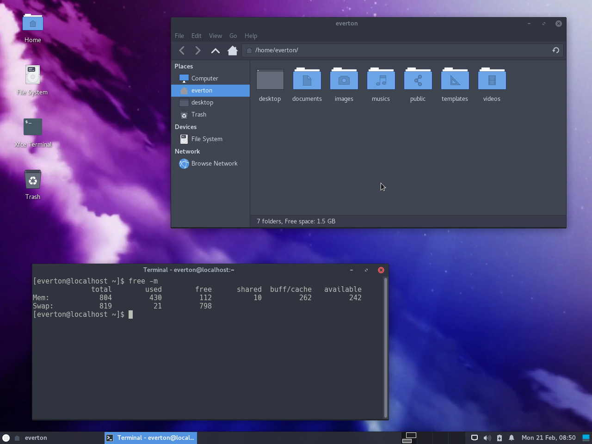

## CentOS 8 Stream Installation

Download Centos 8 Stream

Get the file CentOS-Stream-8-x86_64-latest-boot.iso or something like that from https://www.centos.org/download/

Boot the computer with the iso and install the OS.

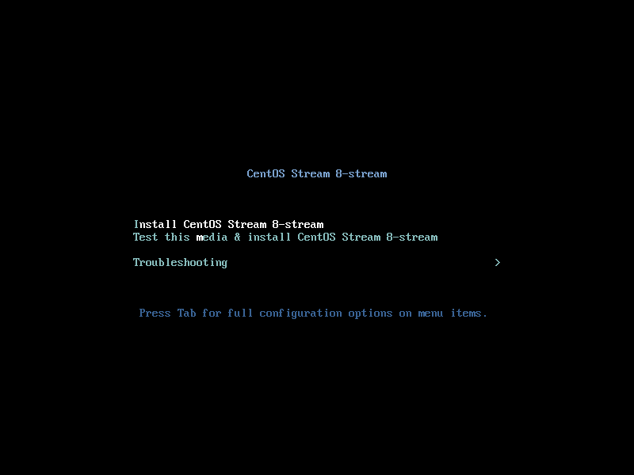

Select language and click "Continue"

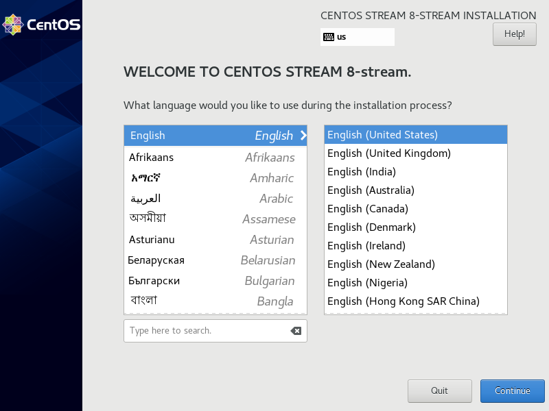

Enter on "Network and Host Name" options

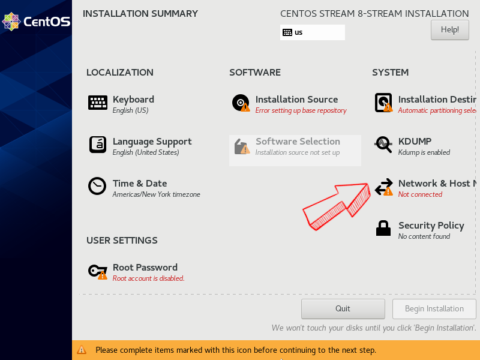

Enable internet

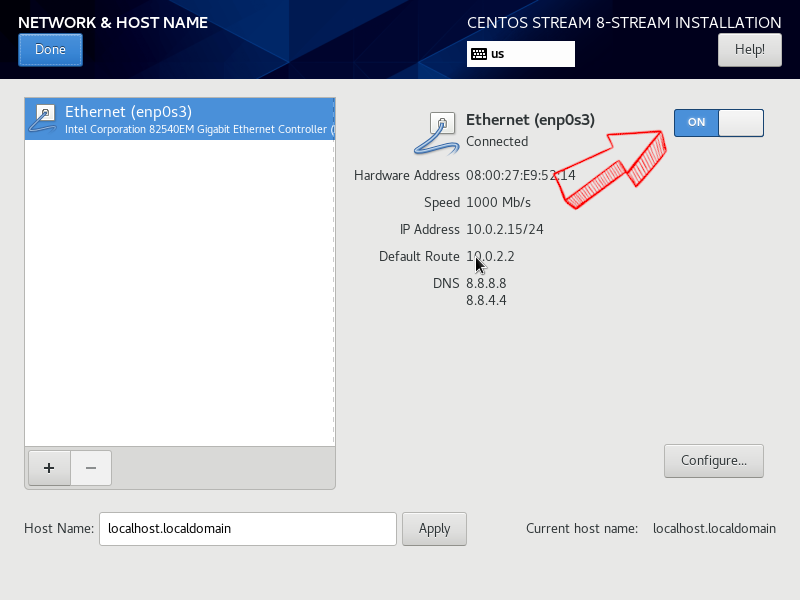

Wait for the system to setting up installation source

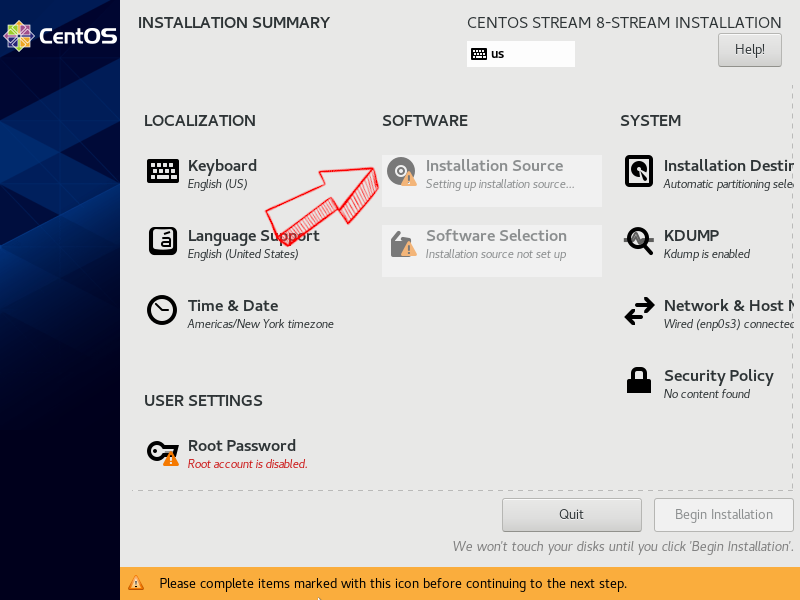

Enter on "Software Selection" options

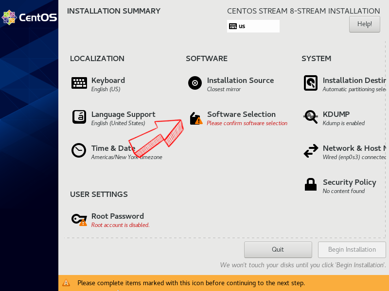

Select "Minimal Install"

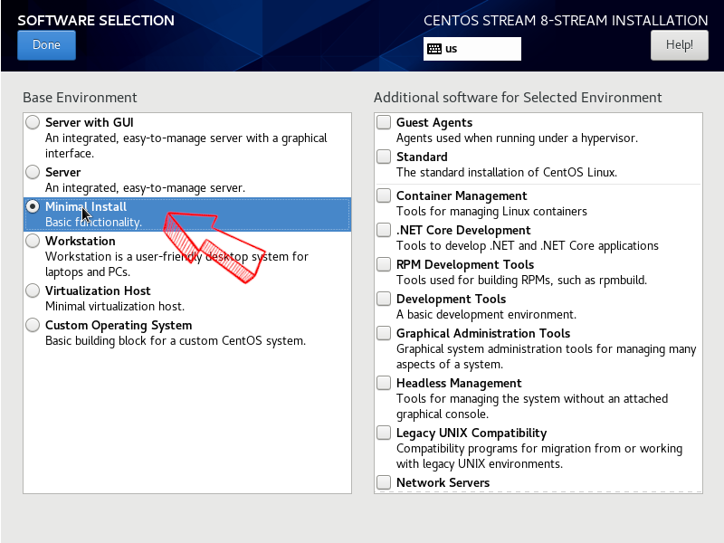

Set a password for "root" user

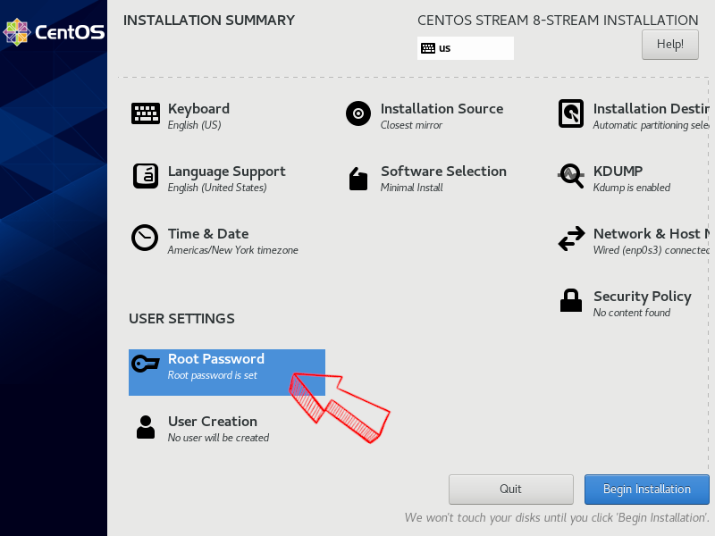

Wait for the installation

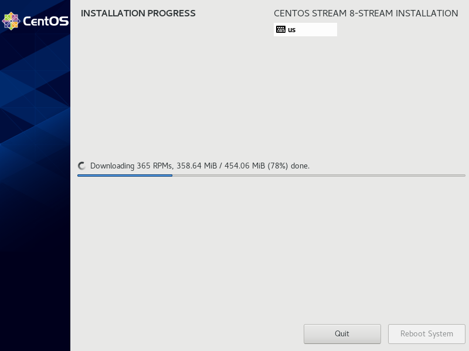

When the installation is done, click on "Reboot System"

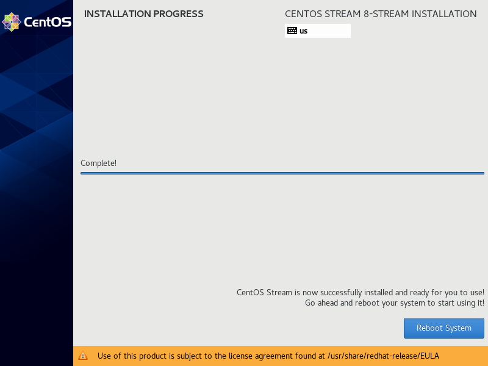

Get the actual IP using the command 

    hostname -I

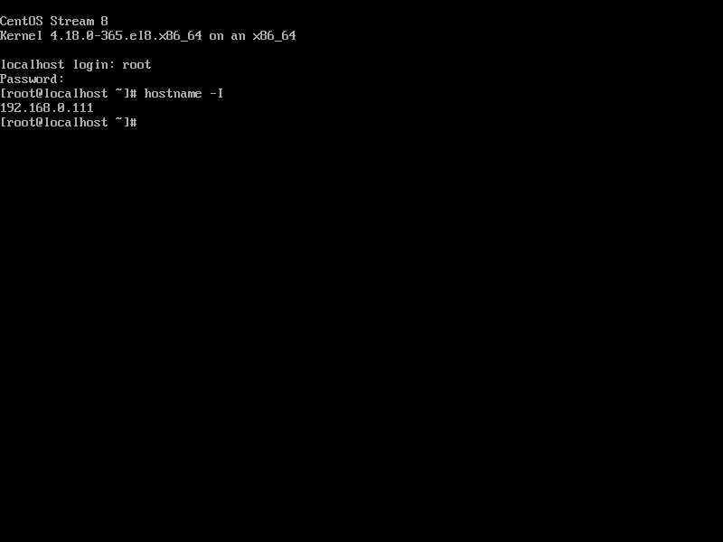


## XFCE Installation

#### Clone project

```bash
git clone https://github.com/evertonmatos/CentOS_XFCE_/
```

### Installing

#### Enter project folder

```bash
cd CentOS_XFCE
```

#### Adjust variables

Open config.yml file and adjust the name of the user to be created

#### Execute installer

```bash
./runner_c8.sh 192.168.0.111 root_password
```
